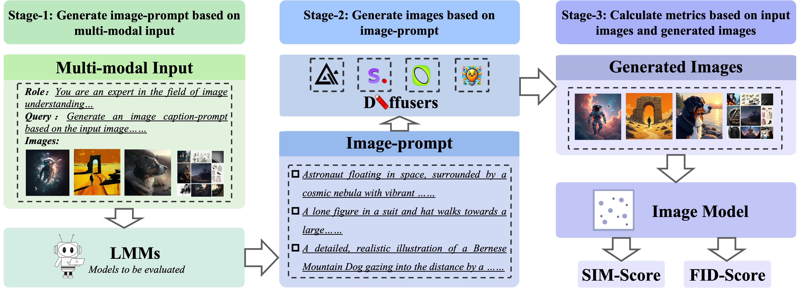

<div align="center">
  <h1 align="center"></h1>
  <h1 align="center">MMGenBench: Evaluating the Limits of LMMs from the Text-to-Image Generation Perspective</h1>
  <div align="center">
        <div class="is-size-5 publication-authors">
              <span class="author-block"> <a href="https://scholar.google.com/citations?user=X0o0Ib8AAAAJ" target="_blank">Hailang Huang</a><sup><text style="color:#ffac33">1</text>,<text style="color:#ed4b82">2</text>*</sup>,</span>&nbsp;
              <span class="author-block"> <a href="https://www.semanticscholar.org/author/Yong-Wang/1683878" target="_blank">Yong Wang</a><sup><text style="color:#ed4b82">2</text></text></sup>,</span>&nbsp;
              <span class="author-block"> <a href="https://scholar.google.com.hk/citations?user=OPxHcAoAAAAJ" target="_blank">Zixuan Huang</a><sup><text style="color:#ffac33">1</text>,<text style="color:#ed4b82">2</text>*</sup>, </span>&nbsp;
              <span class="author-block"> <a href="https://scholar.google.com/citations?user=zp8a-P8AAAAJ" target="_blank">Huaqiu Li</a><sup><text style="color:#ed4b82">2</text>,<text style="color:#6fbf73">3</text>*</sup>, </span>&nbsp;
              <span class="author-block"> <a href="https://scholar.google.com/citations?user=eaZBubIAAAAJ" target="_blank">Tongwen Huang</a><sup><text style="color:#ed4b82">2</text></sup>, </span>
              <br>
              <span class="author-block"> <a href="https://scholar.google.com/citations?user=jn21pUsAAAAJ" target="_blank">Xiangxiang Chu</a><sup><text style="color:#ed4b82">2</text>&dagger;</sup>, </span>&nbsp;
              <span class="author-block"> <a href="https://scholar.google.com/citations?user=bjFPXksAAAAJ" target="_blank">Richong Zhang</a><sup><text style="color:#ffac33">1</text>&Dagger;</sup>
        </div>
        <div class="is-size-5 publication-authors">
              <span class="author-block"><sup><text style="color:#ffac33">1</text></sup>Beihang University,</span>&nbsp;
              <span class="author-block"><sup><text style="color:#ed4b82">2</text></sup>Alibaba Group,</span>&nbsp;
              <span class="author-block"><sup><text style="color:#6fbf73">3</text></sup>Tsinghua University</span>
        </div>
        <div class="is-size-6 publication-authors">
              <span class="author-block"><sup>*</sup>Work done during an internship at Alibaba Group</span>&nbsp;&nbsp;&nbsp;&nbsp;
              <span class="author-block"><sup>&dagger;</sup>Project Leader</span>&nbsp;&nbsp;&nbsp;&nbsp;
              <span class="author-block"><sup>&Dagger;</sup>Corresponding Author</span>
        </div>
    </div>
  📖<a href="https://arxiv.org/abs/2411.14062">Paper</a> | 🏠<a href="https://mmgenbench.alsoai.com/">Homepage</a></h3> | 🤗<a href="https://huggingface.co/datasets/lerogo/MMGenBench">Huggingface</a></h3>
</div>
<div>
Large Multimodal Models (LMMs) have demonstrated remarkable capabilities.
                    While existing benchmarks for evaluating LMMs mainly focus on image comprehension, few works
                    evaluate them from the image generation perspective. To address this issue, we propose a
                    straightforward automated evaluation pipeline. Specifically, this pipeline requires LMMs to generate
                    an image-prompt from a given input image. Subsequently, it employs text-to-image generative models
                    to create a new image based on these generated prompts. Finally, we evaluate the performance of LMMs
                    by comparing the original image with the generated one.
                    Furthermore, we introduce <b>MMGenBench-Test</b>, a comprehensive
                    benchmark developed to evaluate LMMs across 13 distinct image patterns, and <b>MMGenBench-Domain</b>, targeting the performance evaluation of LMMs within
                    the generative image domain.
                    A thorough evaluation involving over 50 popular LMMs demonstrates the effectiveness and reliability
                    in both the pipeline and benchmark. Our observations indicate that numerous LMMs excelling in
                    existing benchmarks fail to adequately complete the basic tasks, related to image understanding and
                    description.
                    This finding highlights the substantial potential for performance improvement in current LMMs and
                    suggests avenues for future model optimization.
                    Concurrently, our pipeline facilitates the efficient assessment of LMMs performance across diverse
                    domains by using solely image inputs.
    
</div>

------


# Usage

## Getting Started

### Environment Installation

Clone this repository

```bash
git clone git@github.com:lerogo/MMGenBench.git

cd MMGenBench
```

Download dataset

```bash
huggingface-cli download --repo-type dataset lerogo/MMGenBench --local-dir MMGenBench-data
```

**Install the relevant environment, including torch, transformers, diffusers and [unicom](https://github.com/deepglint/unicom) (used to extract image representation).**


### Preliminary

We use the `InternVL2-2B` as an example. The structure of the code and data is as follows.

```bash
.
├── MMGenBench-data # The MMGenBench-Test/Domain dataset we downloaded from huggingface
│   ├── MMGenBench-Domain.json
│   ├── MMGenBench-Domain.tsv
│   ├── MMGenBench-Test-label-count.json
│   ├── MMGenBench-Test-label-index.json
│   ├── MMGenBench-Test.json
│   ├── MMGenBench-Test.tsv
│   ├── README.md
│   └── check.py
├── README.md # This file
├── evalimg # For extracting features and calculating metrics using the image representation model
│   ├── metric_fid.py
│   ├── output
│   │   ├── InternVL2-2B_MMGenBench-Domain.json
│   │   └── InternVL2-2B_MMGenBench-Test.json
│   ├── requirements.txt
│   ├── run.py
│   └── run.sh
├── generate # For processing LMMs' output with the text-to-image models
│   ├── flux.py
│   ├── input
│   │   ├── InternVL2-2B_MMGenBench-Domain.xlsx
│   │   └── InternVL2-2B_MMGenBench-Test.xlsx
│   ├── kolors.py
│   ├── lumina.py
│   ├── output
│   │   ├── InternVL2-2B_MMGenBench-Domain.tsv
│   │   └── InternVL2-2B_MMGenBench-Test.tsv
│   ├── requirements.txt
│   ├── run.py
│   ├── run.sh
│   ├── sd.py
│   └── tools.py
└── visual # For visualization
    ├── outputs
    │   ├── InternVL2-2B_MMGenBench-Domain.json
    │   ├── InternVL2-2B_MMGenBench-Domain.xlsx
    │   ├── InternVL2-2B_MMGenBench-Test.json
    │   └── InternVL2-2B_MMGenBench-Test.xlsx
    ├── run.py
    └── run.sh
```

## Evaluation Pipeline

### Stage 1
Adapt your model in [VLMEvalKit](https://github.com/open-compass/VLMEvalKit) and use MMGenBench for inference.

*If VLMEvalKit has not yet merged our code, you can use: https://github.com/lerogo/VLMEvalKit/tree/mmgenbench*

Run command: 
```bash
torchrun --nproc-per-node=4 run.py --model <YOUR LMM> --data MMGenBench-Test MMGenBench-Domain --mode infer --verbose
```

We use the `InternVL2-2B` as an example. Then you can get two files: `InternVL2-2B_MMGenBench-Test.xlsx`, `InternVL2-2B_MMGenBench-Domain.xlsx`. Put them in folder `./generate/input`

### Stage 2

Modify `./generate/run.sh` to select the text-to-image model and to select the number of GPUs you need to use.

And run:
```bash
cd generate
bash run.sh
```

Then you can get two files: `./generate/output/InternVL2-2B_MMGenBench-Test.tsv`, `./generate/output/InternVL2-2B_MMGenBench-Domain.tsv`

### Stage 3

We will use the unicom model to extract features from the original images and generated images, you need to install unicom (https://github.com/deepglint/unicom).

Modify `./evalimg/run.sh` to evaluate the performance on MMGenBench-Test and MMGenBench-Domain respectively.

And run:
```bash
cd evalimg
bash run.sh
```

Then you can get two files: `evalimg/output/InternVL2-2B_MMGenBench-Test.json`, `./evalimg/output/InternVL2-2B_MMGenBench-Domain.json`.

## Visual

Run command:
```bash
cd visual
bash run.sh
```
You can see the relevant results in the `output` folder, including metrics and visualization results.

## Q&A
If you have any questions, please submit an [issue](https://github.com/lerogo/MMGenBench/issues/new) or contact lerogohl\<AT\>gmail.com.


# Citation

If you find MMGenBench or code useful, please cite

```bibtex
@misc{huang2024MMGenBench,
      title={MMGenBench: Evaluating the Limits of LMMs from the Text-to-Image Generation Perspective},
      author={Hailang Huang and Yong Wang and Zixuan Huang and Huaqiu Li and Tongwen Huang and Xiangxiang Chu and Richong Zhang},
      year={2024},
      eprint={2411.14062},
      archivePrefix={arXiv},
      primaryClass={cs.CV},
      url={https://arxiv.org/abs/2411.14062}, 
}
```